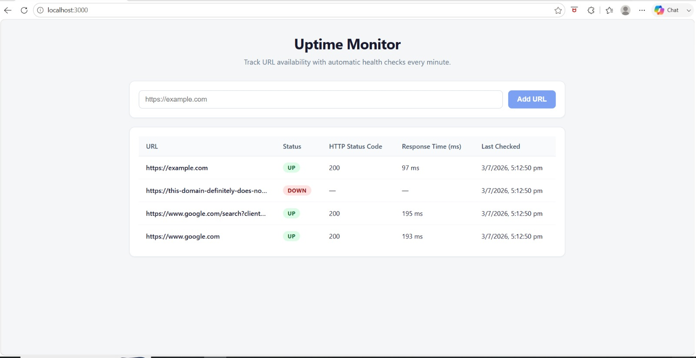
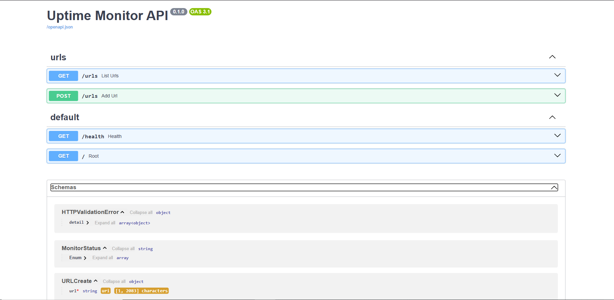

# Uptime Monitor

A lightweight full-stack uptime monitoring application that periodically checks the availability of registered URLs, measures response time, and displays their current operational status through a live dashboard.

---

## Features

- Add URLs to monitor
- Automatic health checks every minute
- Displays:
  - URL
  - Current Status (UP / DOWN / UNKNOWN)
  - HTTP Status Code

  - Response Time (ms)
  - Last Checked Timestamp
- Auto-refreshing React dashboard
- PostgreSQL database for persistent storage
- Fully containerized using Docker Compose

---

## Tech Stack

### Backend
- FastAPI
- SQLAlchemy
- APScheduler
- PostgreSQL

### Frontend
- React
- Vite
- Axios

### DevOps
- Docker
- Docker Compose
- Nginx

---

## Project Structure

```
uptime-monitor/
│
├── backend/
├── frontend/
├── screenshots/
├── README.md
├── AI_LOG.md
├── docker-compose.yml
└── .gitignore
```

---

## Running the Project

Start the complete application using Docker:

```bash
docker compose up --build
```

Services:

| Service | URL |
|----------|--------------------------|
| Frontend | http://localhost:3000 |
| Backend API | http://localhost:8000 |
| Swagger Docs | http://localhost:8000/docs |

---

## API Endpoints

### Add URL

POST `/urls`

Example:

```json
{
  "url": "https://example.com"
}
```

### Get All URLs

GET `/urls`

Returns the latest monitoring status for all registered URLs.

---

## Testing

### Working URL

Add:

```
https://example.com
```

Expected result:

- Status: UP
- HTTP Status Code: 200
- Response Time displayed

### Invalid URL

Add:

```
https://this-domain-definitely-does-not-exist-123456789.com
```
Newly added URLs initially appear as UNKNOWN until the first scheduled health check executes.

After the scheduler runs, it should display:

- Status: DOWN

---

## How it Works

1. User submits a URL through the React frontend.
2. FastAPI validates and stores it in PostgreSQL.
3. APScheduler runs every minute.
4. The backend sends an HTTP request to each stored URL.
5. Status, response time, and timestamp are updated.
6. The frontend refreshes automatically every 5 seconds to display the latest results.

---

## Deployment Sketch

A simple cloud deployment for this MVP could use:

- React + Nginx hosted on a virtual machine or container service
- FastAPI running in a Docker container
- PostgreSQL managed database
- Docker Compose (or Kubernetes/ECS in production)
- Reverse proxy such as Nginx

---
## Screenshots

### Dashboard



### API Documentation



---

## Future Improvements

- Historical uptime tracking
- Email or Slack alerts
- Authentication
- Charts and analytics
- Configurable monitoring intervals
